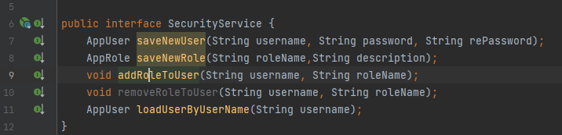

# mvcpatients1

<h1> Activité pratique N°3 JEE : Spring MVC, Thymeleaf, Spring Data et Spring Security
</h1>
<h2 style="text-decoration: underline;">1- objectif:</h2>

Développer une application web baseé sur Sprint MVC, ThymeLeaf et Spring Data qui permet de gérer des patients.

L' Application doit permettre de : 

<ul>
<li> Chercher des Patients avec Pagination  </li>
<li> Supprimer un Pateint </li>
<li> Ajouter un Payient avec validation du formulaire </li>
<li> Editer et Mettre A jour un Patient </li>
<li>cree une page Template basée sur Thymeleaf Layout</li>
</ul>

<h2 style="text-decoration: underline;">2- Architectur :</h2>

<h2 style="text-decoration: underline;">3- Travail a faire</h2>

<ol type="1">

<dt><li> Cree un projet Spring Boot avec les dépendances </li></dt>
<dd>Spring DATA JPA , H2, Web ,themeleaf st Lombok </dd>
<dt><li>Créer La couche DAO</li></dt>
<dd>
<ul>
<li>Cree l'entite jpa Patient</li>
<li> cree L'interface Patient Repository basée sur Spring DAta </li>
<li>Tester la couche Dao</li>
</ul> 
</dd>
<dt><li>Créer la couche web </li></dt>
<ul>
<dd><li> Creer le controleur Spring MVC</li>
<li>Cree les vue basee sur le moteur de Templates Thymeleafe </li>
</dd>
</ul>
</ol>

<h2 style="text-decoration: underline;">4-Créer La couche DAO</h2>

<h2 style="text-decoration: underline;">5- Créer la couche web</h2>
<h3> le controller </h3>

  se controller contient le pagination 
 

<h3> patients html </h3>

Remarque tous les attributs que vous avez ajoter dans le model thymlef peut lacceder 

la pagination dnas template 

<h2 style="text-decoration: underline;">6- Validation </h2>

 pour valider les attributes de donnee 

au niveau de controller ajouter "bindingressult" et @valide pour Patient 

 
<h1>  Spring Security : Activité pratique N°4 ; Spring Boot Spring MVC Thymeleaf Spring Securiry User Details Service: </h1>

            <h2 style="text-decoration: underline;">1- objectif:</h2>
        

            Sécuriser L'accés a l'Application 
            qui permet de géer les Patients en utilisant Spring Security . L'accées à L'aplication nécessite une Authentification avec
            un Username et mot de passe .un utilisateur peut avoir plusieurs Role ;
        

        <dl>
          <dt>ROLE_USER:</dt>
          <dd >-permettant de chercher des patients</dd>
          <dt>Role_ADMIN</dt>
          <dd>- permettant d'ajouter, mettre àajour et supprimer les patients</dd>
        </dl>

 <h2 style="text-decoration: underline;">2- Architectur :</h2>
    

<h2 style="text-decoration: underline;">2- Travail a faire :</h2>

 

<ol type="1">
  <li>Ajouter la dépendance maven de Spring Security  </li>
  <li>Personnaliser la configuration de Spring Security Suivantes avec la Startégie InMemoryAuthentication  
<dl>
  <dt>-Auhtentification avec le Role USER pour pouvoir Consulter Les Patients</dt>
  <dt>-Authentification Avec le role ADMIN pour pouvoir Ajouter ,Editer,mettre à  jour et supprimer des Patients </dt>
    <dt> -permettre l'accés aux ressources statique (/webJars/**) sans aucune authentification </dt> 
</dl>
</li>

<li> Basculer de La Statégie InMemory Authentification Vers JDBCD Authentification </li>
<li>Basculer Vers La Stratégie UserDetailsService </li>

</ol>

 <h2 style="text-decoration: underline;">3- Ajouter la dépendance maven de Spring Security:</h2>

 <h2 style="text-decoration: underline;">4 -Personnaliser la configuration de Spring Security Suivantes avec la Startégie InMemoryAuthentication</h2>

 deux condition : 
        
<dl>
        <dt> @Configuration;</dt>
        <dd>c'est une class de configuration le sprint sera instancier le 1er </dd>
        <dt> @EnableWebSecurity </dt>
        <dd>Activer la security Web </dd>
        
</dl>
    

    <dl>
        <dt>AuthenticationManagerBuilder</dt>
        <dd>comment spring security chercher les users est les roles "ldap/database/mimory"
        <ol type="1">
      <li>InMemoryAuthentication</li>
    
    </ol>
    </dd>
        <dt> HttpSecurity </dt>
        <dd>
    securiser les urls
    
 meme l'utilisateur essaies par les urls il n'avait pas les droit 
 pour sela i l faut de chenger tous les urls (frompatient,editPatients..)

    
</dd>
    
</dl>

<h3 style="text-decoration: underline;"> La contextuality :  </h3>

<ol>

<dl>

<dt> Template :</dt>
<dd>   
   xmlns:sec="http://www.thymeleaf.org/extras/spring-security">

  isauthenticated =si seulement si  l user est authentifier 

</dd>

<dt> suprimmer et Editer   </dt>

<dd> </dd>

<dt> show  unanutherized Action 403 </dt>

<dd>  </dd>

</dl>

</ol>

<h3 style="text-decoration: underline;">5- Basculer de La Statégie InMemory Authentification Vers JDBCD Authentification
</h3>
<h4> 1- Add dans la base  de donnée des usesr and Roles  </h4>

<h4>2-SecurityConfig </h4>

<ol  type="i">

<dl>
<li>
<dt>database source </dt>
</li>
<li>
<dt>1er requet Sql </dt>
<dd> - chercher l utilisateur </dd>
</li>
<li>
<dt>2eme requet SQL </dt>
<dd> -charger les roles de cet utlisateur </dd>
</li>
<li>
<dt>donne les droites d'accès a les resource statique</dt>
<dd>  </dd>
</li>
</dl>

</ol>

<h3 style="text-decoration: underline;">5-Basculer Vers La Stratégie UserDetailsService</h3>

<ol type="1">

<dl>

<li><dt>gérer les utilisateurs et les Roles</dt>
<dd>
<ul>
<li>
cree les class APPUser et APPRole 

</li>
<li>la class AppUser : EAGER(charger les role tous les role de l utilistaeur au memoire "
lazy = getApproles() )

</li>
<li>Class AppRole </li>
<li>--------</li>
</ul>
 
</dd>
</li>
<li><dt>Service</dt></li>
<dd>
<ul>
<li>SecurityService : une interface pour declarer les methode
</li>
<li>une implementation : pour implementer les methodes  </li>
<li>implement UserDetailsService ;</li>
<li>security  configure :  </li>
<li> Remarque !! pour la dependance circulair soit :
<dl><dt> 1er method :</dt>
<dd> </dd>
<dt> 2eme methode : lorigine de probleme dans securityConfigue il sefait de sortire password incouder dans le main :</dt>
<dd></dd>

</dl>

</li>
</ul>
</dd>

</dl>
</ol>

